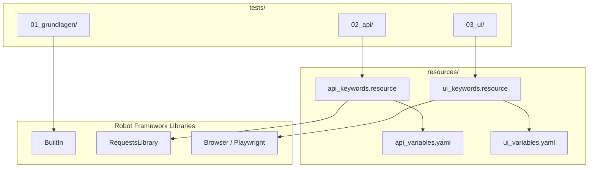

# Architektur: Repo-Struktur verstehen

## Ordnerstruktur

```
robotframework-testing-service/
│
├── tests/                         # Alle Test-Suiten
│   ├── 01_grundlagen/             # Grundlagen-Tests
│   ├── 02_api/                    # API Tests
│   └── 03_ui/                     # UI/Browser Tests
│
├── resources/                     # Wiederverwendbare Ressourcen
│   ├── keywords/                  # Eigene Keywords (Bibliotheken)
│   │   ├── api_keywords.resource  # Keywords für API-Tests
│   │   └── ui_keywords.resource   # Keywords für UI-Tests
│   └── variables/                 # Konfigurationsvariablen
│       ├── api_variables.yaml     # URLs, Timeouts für API
│       └── ui_variables.yaml      # Browser, URLs für UI
│
├── docs/                          # Dokumentation
│   ├── de/                        # Deutsch
│   └── en/                        # Englisch
│
└── .github/
    └── workflows/
        └── robot-tests.yml        # CI/CD Pipeline
```

---

## Kernkonzepte erklärt

### 1. Test Cases (`*** Test Cases ***`)

Der eigentliche Test. Jeder Test-Case hat einen Namen und eine Abfolge von Keywords:

```robot
*** Test Cases ***
Benutzer kann sich einloggen
    Öffne Browser auf Login-Seite
    Gib Benutzername ein    standard_user
    Gib Passwort ein        secret_sauce
    Klicke auf Login-Button
    Prüfe ob Produkt-Seite angezeigt wird
```

### 2. Keywords (`*** Keywords ***`)

Keywords sind wiederverwendbare Aktionsblöcke — vergleichbar mit Funktionen:

```robot
*** Keywords ***
Öffne Browser auf Login-Seite
    New Browser    chromium    headless=${HEADLESS}
    New Page       ${LOGIN_URL}
```

### 3. Variables (`*** Variables ***`)

Variablen machen Tests konfigurierbar und wiederverwendbar:

```robot
*** Variables ***
${LOGIN_URL}    https://www.saucedemo.com
${HEADLESS}     true
```

### 4. Settings (`*** Settings ***`)

Hier werden Libraries und Resource-Dateien importiert:

```robot
*** Settings ***
Library     Browser
Resource    ../../resources/keywords/ui_keywords.resource
Variables   ../../resources/variables/ui_variables.yaml
```

---

## Trennung von Tests und Ressourcen

**Warum?** Um Wiederverwendbarkeit zu maximieren und Tests lesbar zu halten.

```
tests/03_ui/saucedemo_shopping.robot
    → importiert resources/keywords/ui_keywords.resource
        → enthält wiederverwendbare Keywords
    → importiert resources/variables/ui_variables.yaml
        → enthält URLs und Konfiguration
```

So müssen URLs und Browser-Einstellungen nur **einmal** geändert werden — in der
Variables-Datei — und alle Tests profitieren davon.



---

## Test-Struktur

| Ordner            | Inhalt                              | Libraries                 |
|-------------------|-------------------------------------|---------------------------|
| `01_grundlagen/`  | Syntax, Keywords, Variables         | BuiltIn                   |
| `02_api/`         | GET/POST/PUT/DELETE, Assertions     | RequestsLibrary           |
| `03_ui/`          | Browser, Formulare, Locators        | Browser (Playwright)      |

---

## Report-Struktur

Nach einem Testlauf erzeugt Robot Framework automatisch:

| Datei         | Inhalt                                        |
|---------------|-----------------------------------------------|
| `output.xml`  | Rohdaten aller Testergebnisse (maschinenlesbar)|
| `log.html`    | Detailliertes Log mit allen Schritten         |
| `report.html` | Übersichts-Report (Bestanden/Fehlgeschlagen)  |

Diese Dateien werden von `.gitignore` ausgeschlossen und nur lokal / als CI-Artefakt gespeichert.
