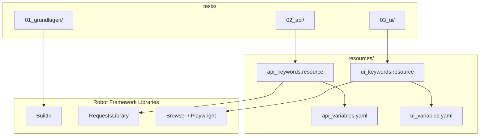

# Architecture: Understanding the Repo Structure

## Folder structure

```
robotframework-testing-service/
│
├── tests/                         # All test suites
│   ├── 01_grundlagen/             # Basics
│   ├── 02_api/                    # API Tests
│   └── 03_ui/                     # UI/Browser Tests
│
├── resources/                     # Reusable resources
│   ├── keywords/                  # Custom keywords (libraries)
│   │   ├── api_keywords.resource  # Keywords for API tests
│   │   └── ui_keywords.resource   # Keywords for UI tests
│   └── variables/                 # Configuration variables
│       ├── api_variables.yaml     # URLs, timeouts for API
│       └── ui_variables.yaml      # Browser, URLs for UI
│
├── docs/                          # Documentation
│   ├── de/                        # German
│   └── en/                        # English
│
└── .github/
    └── workflows/
        └── robot-tests.yml        # CI/CD pipeline
```

---

## Core concepts explained

### 1. Test Cases (`*** Test Cases ***`)

The actual test. Each test case has a name and a sequence of keywords:

```robot
*** Test Cases ***
User can log in
    Open browser on login page
    Enter username    standard_user
    Enter password    secret_sauce
    Click login button
    Verify product page is displayed
```

### 2. Keywords (`*** Keywords ***`)

Keywords are reusable action blocks — comparable to functions:

```robot
*** Keywords ***
Open browser on login page
    New Browser    chromium    headless=${HEADLESS}
    New Page       ${LOGIN_URL}
```

### 3. Variables (`*** Variables ***`)

Variables make tests configurable and reusable:

```robot
*** Variables ***
${LOGIN_URL}    https://www.saucedemo.com
${HEADLESS}     true
```

### 4. Settings (`*** Settings ***`)

Libraries and resource files are imported here:

```robot
*** Settings ***
Library     Browser
Resource    ../../resources/keywords/ui_keywords.resource
Variables   ../../resources/variables/ui_variables.yaml
```

---

## Separation of tests and resources

**Why?** To maximize reusability and keep tests readable.

```
tests/03_ui/saucedemo_shopping.robot
    → imports resources/keywords/ui_keywords.resource
        → contains reusable keywords
    → imports resources/variables/ui_variables.yaml
        → contains URLs and configuration
```

This way, URLs and browser settings only need to be changed **once** — in the
variables file — and all tests benefit from it.



---

## Test structure

| Folder            | Content                              | Libraries                  |
|-------------------|--------------------------------------|----------------------------|
| `01_grundlagen/`  | Syntax, keywords, variables          | BuiltIn                    |
| `02_api/`         | GET/POST/PUT/DELETE, assertions      | RequestsLibrary            |
| `03_ui/`          | Browser, forms, locators             | Browser (Playwright)       |

---

## Report structure

After a test run, Robot Framework automatically generates:

| File          | Content                                            |
|---------------|----------------------------------------------------|
| `output.xml`  | Raw data of all test results (machine-readable)    |
| `log.html`    | Detailed log with all steps                        |
| `report.html` | Summary report (passed/failed)                     |

These files are excluded by `.gitignore` and only stored locally / as CI artifacts.
